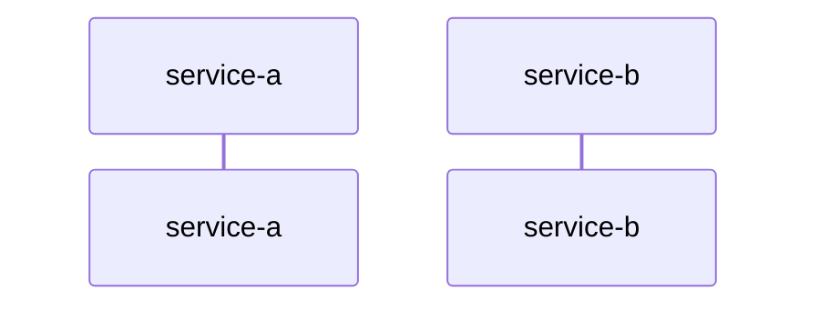

## 任务：生成核心流程文档

你是一名资深系统架构师。请根据调用方传入的 flow 信息和涉及服务的事实文档，生成一份跨服务核心流程文档。

## 调用方需传入

- `flow-id`
- `flow 名称`
- `trigger`
- `services`
- `输出路径`

## 输入来源

除调用方传入信息外，读取以下内容：

1. `docs/knowledge/index.md` — knowledge 总入口，先建立完整知识地图
2. `docs/knowledge/services/{service}/service-meta.yaml`
3. `docs/knowledge/services/{service}/service-boundary.md`
4. `docs/knowledge/services/{service}/domain-model.md`
5. `docs/knowledge/services/{service}/api/index.md`（若存在）
6. `docs/knowledge/services/{service}/database/index.md`（若存在）

## 输出要求

- **位置**：调用方传入的 `输出路径`
- **格式**：Markdown

## 分析原则

- **seed 只决定范围，不决定细节**：具体顺序、接口、事件由事实文档补齐
- **强调业务动作，不写代码实现**
- **主写数据必须能归属到服务**
- **不猜测**：无法确认的链路节点标注 `<!-- TODO: 待确认 -->`

## 输出格式

````markdown
# {flow 名称}

> flow-id: {flow-id}
> 触发入口：{trigger}
> 参与服务：service-a, service-b, service-c

---

## 1. 流程目标

{描述该流程要完成什么业务目标}

## 2. 参与服务与职责

| 服务 | 角色 | 业务动作 |
|------|------|----------|
| `front-service` | 接入层 | 接收申请、参数校验、发起主流程 |

## 3. 主流程

1. ...
2. ...

## 4. 关键接口与事件

| 类型 | 发起方 | 名称 | 业务作用 |
|------|--------|------|----------|
| API | `front-service` | `POST /credit/apply` | 发起授信申请 |

## 5. 数据归属

| 服务 | 主写数据 | 说明 |
|------|----------|------|
| `credit-service` | `credit_application` | 授信申请主写 |

## 6. 幂等与补偿

### 6.1 幂等点

- ...

### 6.2 补偿点

- ...

## 7. 异常兜底

| 场景 | 异常 | 兜底策略 |
|------|------|----------|
| ... | ... | ... |

## 8. 时序图


````

## 注意事项

- 若同一流程存在同步和异步两种实现，需明确标注主路径与补充路径
- `时序图` 只画关键节点，不画低层实现细节
