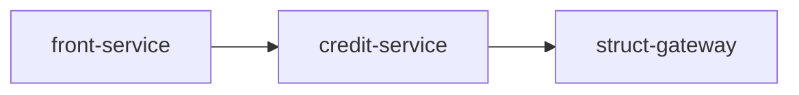

## 任务：生成系统全景图

你是一名系统架构师。请基于集中式文档库中各服务的事实文档，生成一份高密度的系统全景图文档。

## 输入来源

读取以下内容：

1. `docs/knowledge/index.md` — knowledge 总入口，先建立完整知识地图
2. `docs/knowledge/services/*/service-meta.yaml`
3. `docs/knowledge/services/*/service-boundary.md`
4. `docs/knowledge/services/*/domain-model.md`
5. `docs/knowledge/system/core-flows/*.md`（若存在）

## 输出要求

- **位置**：`docs/knowledge/system/system-map.md`
- **格式**：Markdown

## 目标

该文档必须同时回答：

1. 系统里有哪些服务
2. 这些服务之间如何同步调用 / 异步协同
3. 当前已梳理出的核心业务链路有哪些

## 分析原则

- **事实优先**：服务角色、上下游、owned data 以 `service-meta.yaml` 为主
- **边界优先**：核心职责以 `service-boundary.md` 为主
- **不猜测**：无法确认的拓扑关系标注 `<!-- TODO: 待确认 -->`
- **可读性优先**：输出给架构师、产品经理、新加入的研发，不写实现类名

## 输出格式

````markdown
# 系统全景图

> 生成时间：YYYY-MM-DD
> 信息来源：docs/knowledge/services/* 下的事实文档

---

## 1. 服务清单

| 服务 | 展示名 | 业务域 | 系统角色 | 核心职责 | Owner |
|------|--------|--------|----------|----------|-------|
| `front-service` | 前置服务 | loan-entry | gateway | 接入请求、参数适配、流程发起 | front-team |

---

## 2. 服务拓扑

### 2.1 同步调用关系



### 2.2 异步事件关系

| 发布方 | 事件 | 消费方 | 业务含义 |
|--------|------|--------|----------|
| `credit-service` | `credit.approved` | `struct-gateway` | 授信通过后继续资金编排 |

### 2.3 高风险依赖

| 上游 | 下游 | 风险点 | 说明 |
|------|------|--------|------|
| `front-service` | `credit-service` | 同步强依赖 | 授信超时会直接影响前置链路 |

---

## 3. 核心链路索引

| 链路 | 触发入口 | 参与服务 | 详情 |
|------|----------|----------|------|
| 授信申请链路 | 用户发起授信申请 | `front-service` → `user-center` → `credit-service` → `struct-gateway` | [credit-apply.md](./core-flows/credit-apply.md) |
````

## 注意事项

- `系统角色` 仅允许：`gateway` / `orchestrator` / `domain` / `platform`
- `核心职责` 要从边界文档提炼，不要罗列 API
- 没有 `core-flows/*.md` 时，`核心链路索引` 保留空表并写明“待补充 flow-seeds”
