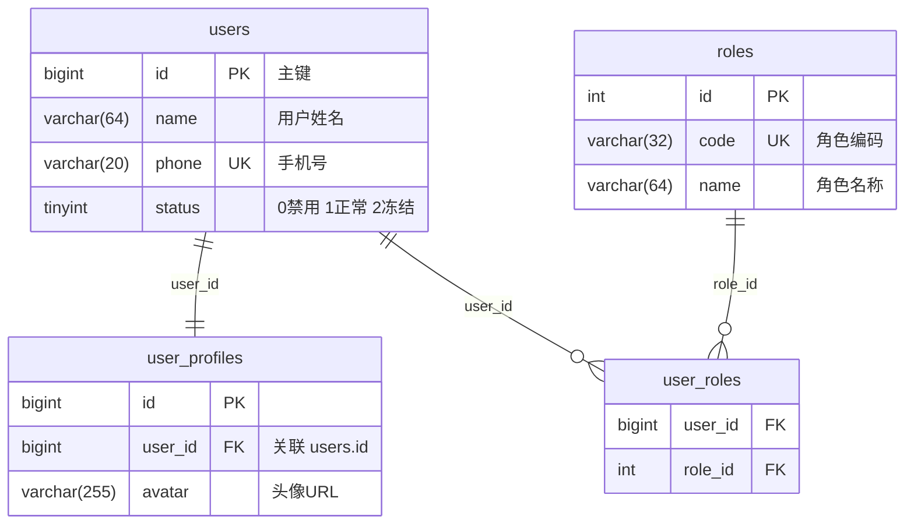
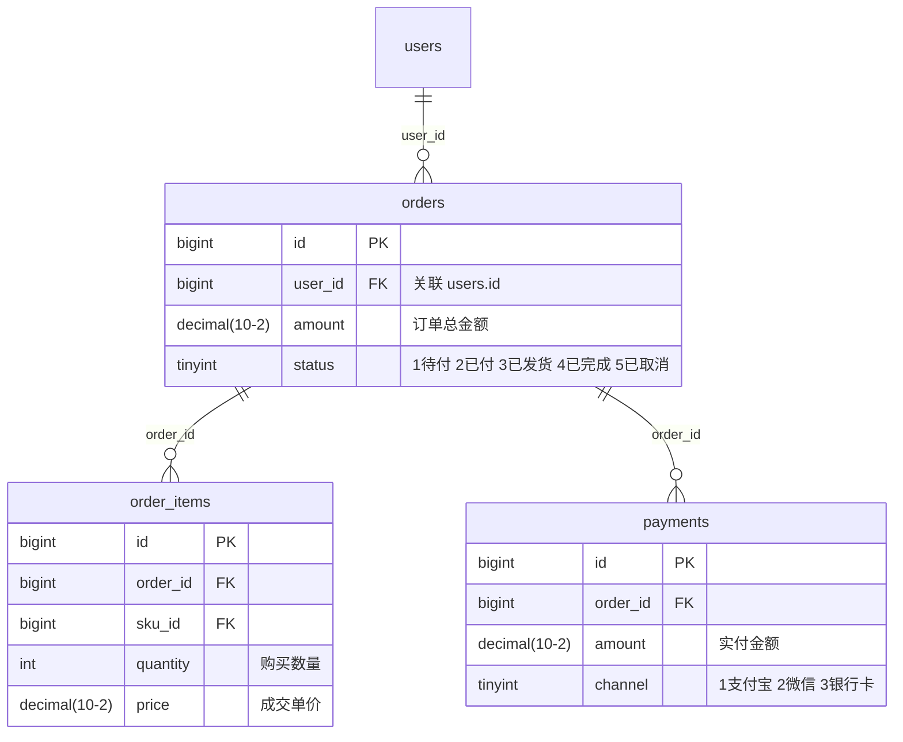

## 任务：生成项目数据模型清单

你是一名数据库架构师。请扫描整个代码库，生成一份完整的数据库表结构清单。

## 输出要求

- **位置**：`docs/knowledge/database/index.md`（表清单总览 + 字段详情），ER 图独立输出到 `docs/knowledge/database/er.md`
- **格式**：Markdown
- **er.md** 是独立的可视化文档，格式要求见下方"ER 图输出格式"章节

## 扫描策略

### 1. 表定义定位

按以下优先级扫描，尽量多源交叉验证：

**Java 项目**
- `@Entity` / `@Table` 注解类 → 获取表名、字段名、类型
- `@Column` 注解 → 获取实际列名（字段名与列名不一致时以此为准）
- MyBatis XML 的 `<resultMap>` → 补充 Entity 中未定义的字段
- `@OneToMany` / `@ManyToOne` / `@JoinColumn` → 提取外键关系

**Go 项目**
- GORM Model 定义（`gorm:"column:xxx"`）
- SQL migration 文件（`.sql`）

**通用**
- `sql/`、`migrations/`、`schema/`、`db/` 目录下的 `.sql` 文件
- `CREATE TABLE` 语句 → 最权威的 schema 来源，优先使用

### 2. 枚举识别

- 找到字段关联的枚举类，列出所有枚举值和含义
- 若无枚举类，从注释或业务代码中推断状态含义
- **枚举值必须写入 database.md 对应字段的"枚举值说明"列**，格式：`值:含义`，多个值用顿号分隔，如 `0:禁用、1:正常、2:冻结`

### 3. 索引识别

- `@Index` / `@UniqueConstraint` 注解
- SQL 文件中的 `CREATE INDEX` / `UNIQUE KEY` 语句
- GORM tag 中的 `uniqueIndex` / `index`

### 4. 分库分表识别

- ShardingSphere 配置文件
- 自定义分表注解或路由逻辑
- 若无分表，填"无"

### 5. 多数据源标注

- 识别 `@DS` 注解（dynamic-datasource）或多 DataSource Bean 配置
- 标注每张表属于哪个数据源

## 输出格式

### database.md 格式

```markdown
# 数据模型清单

> 生成时间：YYYY-MM-DD
> 数据表总数：N 张

## 1. 表清单总览

| 序号 | 表名 | 中文名称 | 核心字段 | 分库分表 | 数据源 | 所属模块 |
| :--- | :--- | :--- | :--- | :--- | :--- | :--- |
| 1 | users | 用户表 | id, name, phone, status | 无 | master | 用户 |
| 2 | orders | 订单表 | id, user_id, amount, status | user_id % 16 | order_db | 订单 |

## 2. 表字段详情

### 2.1 users（用户表）

| 字段名 | 数据类型 | 允许为空 | 默认值 | 字段含义 | 枚举值说明 |
| :--- | :--- | :---: | :--- | :--- | :--- |
| id | bigint | 否 | - | 主键ID | - |
| name | varchar(64) | 否 | - | 用户姓名 | - |
| status | tinyint | 否 | 1 | 用户状态 | 0:禁用、1:正常、2:冻结 |
| created_at | datetime | 否 | CURRENT_TIMESTAMP | 创建时间 | - |

> 枚举值说明：有枚举类或注释时必须填写完整，格式为 `值:含义`，多个值用顿号分隔；无法确定时标注 `<!-- TODO: 待确认 -->`

**索引**

| 索引名 | 类型 | 字段 | 说明 |
| :--- | :--- | :--- | :--- |
| PRIMARY | 主键 | id | - |
| uk_phone | 唯一索引 | phone | 手机号唯一 |
| idx_status | 普通索引 | status | 按状态查询 |

---

*共计 N 张数据表*
```

### er.md 格式

er.md 是独立的 ER 关系图文档，按业务模块分区，每个模块用独立 mermaid 代码块展示，并附带文字说明提升可读性。

```markdown
# ER 关系图

> 生成时间：YYYY-MM-DD
> 说明：按业务模块分区展示，聚焦核心关联字段，省略纯审计字段（created_at / updated_at 等）

---

## 模块一：用户体系

**包含表**：users、user_profiles、user_roles

**关系说明**：
- `users` 1:1 `user_profiles`：每个用户对应一份扩展信息
- `users` N:N `roles`（通过 `user_roles` 中间表）：用户可拥有多个角色



---

## 模块二：订单体系

**包含表**：orders、order_items、payments

**关系说明**：
- `orders` 1:N `order_items`：一笔订单包含多个商品行
- `orders` 1:N `payments`：一笔订单可有多次支付记录（如拆单支付）



---

## 跨模块关联

**说明**：列出跨越以上模块边界的关联关系，帮助理解整体数据流向。

| 主表 | 关联表 | 关联字段 | 关系 | 跨模块含义 |
| :--- | :--- | :--- | :--- | :--- |
| orders | users | orders.user_id → users.id | N:1 | 订单归属用户（订单体系 → 用户体系） |
```

**er.md 生成规则**：
1. 按业务模块聚合，每模块一个 mermaid 块，不要把所有表塞进一个图
2. 每个实体只写**核心字段**（主键、外键、关键业务字段），省略 created_at / updated_at / deleted_at 等审计字段
3. 字段注释用引号写在类型后面，把枚举值的关键含义直接标在字段上（如 `"0禁用 1正常"`）
4. 每个模块前写"关系说明"文字，用自然语言描述关联含义，不要只靠图形表达
5. 跨模块的外键关系统一收录到最后的"跨模块关联"表格中

## 注意事项

- 若同一张表在多处定义（Entity + SQL 文件），以 SQL 文件为准，Entity 作为补充
- 无法确定枚举含义时标注 `<!-- TODO: 待确认 -->`
- 无法确定中文名称时标注 `<!-- TODO: 待确认 -->`
- 若项目无任何数据库定义，输出说明并退出
