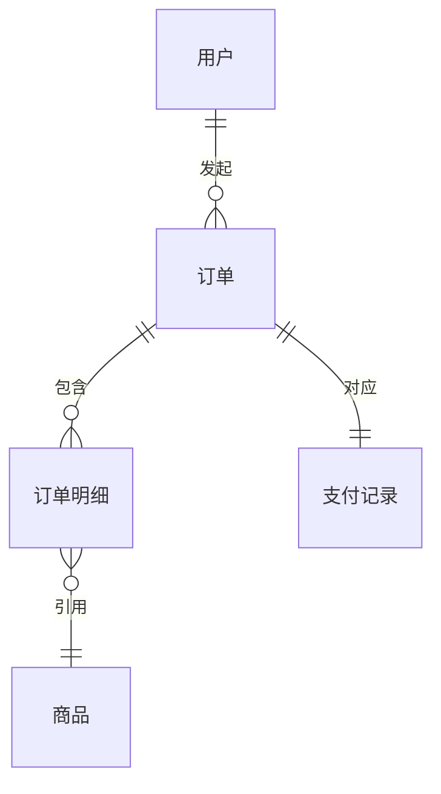
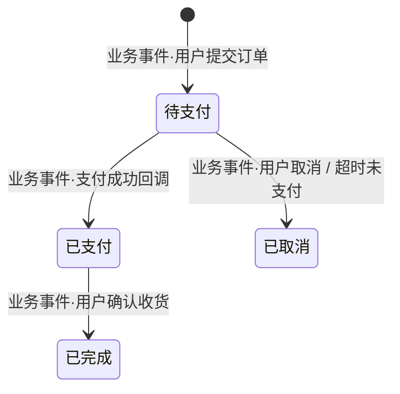

## 任务：生成服务能力地图

你是一位高级产品架构师。基于已生成的项目文档和代码分析，生成一份以**业务视角**描述服务职责的能力地图。读者是产品经理和新加入的业务开发，不是运维或基础架构工程师。

## 输入来源

按优先级读取以下文档作为分析基础：

1. `docs/knowledge/architecture.md` — 技术栈与架构（scan-tech 输出）
2. `docs/knowledge/api/index.md` — 接口清单（scan-api 输出）
3. `docs/knowledge/database/index.md` — 数据模型清单（scan-db 输出）
4. 代码本身 — Service 层方法、MQ consumer/producer、状态枚举

## 输出要求

- **位置**：`docs/knowledge/domain-model.md`
- **格式**：Markdown

## 分析原则

- **业务优先**：每一节都要回答"这个服务/模块是为了解决什么业务问题"，而不是描述它是怎么实现的
- **不猜测**：无法从代码或文档中确认的内容，一律标注 `<!-- TODO: 待确认 -->`
- **不罗列技术实现**：去掉代码入口、类名、方法名等实现细节；只保留业务能力、数据流向、业务依赖
- **R/W 必须分析代码确认**：涉及表的读写标注需看 Service/Dao 层实际调用，不能凭接口名推断

## 分析步骤

1. **服务定位**：从项目名、README、包结构，代码注释等 推断服务核心业务职责和在业务体系中的角色
2. **业务场景识别**：识别 3-5 个核心业务场景，每个场景描述触发条件、业务目标和涉及的数据
3. **模块聚合**：将接口按业务域分组，每个模块用一段话描述它解决的业务问题
4. **数据归属判断**：区分本服务主写的表 vs 只读的外部同步表，说明每张表代表的业务含义
5. **领域对象识别**：从数据库表、核心实体类、DTO 中识别关键业务对象，理解其业务含义和相互关系
6. **事件流扫描**：找出 MQ producer（发布的业务事件）和 consumer（响应的业务事件）及其业务含义
7. **状态机提取**：识别带 status/state 字段的核心实体，提取状态流转及每个状态变化的业务触发事件
8. **业务规则提取**：扫描 Service 层的前置校验、guard 条件、业务异常抛出，提炼为面向业务的约束规则
9. **角色与权限识别**：从鉴权注解、权限枚举、接口文档中识别角色，建立角色→能力的映射
10. **异常场景梳理**：识别关键业务流程中的失败路径，关注业务兜底策略（补偿、回滚、人工介入等）

## 输出格式

```markdown
# [服务名称] 能力地图

> 生成时间：YYYY-MM-DD

---

## 1. 服务定位

| 项目 | 内容 |
| :--- | :--- |
| 服务职责 | [一句话描述这个服务解决什么业务问题] |
| 系统角色 | [核心域 / 支撑域 / 通用域] |
| 上游调用方 | [哪些业务方/端依赖本服务] |
| 下游业务依赖 | [本服务依赖哪些下游业务能力] |

---

## 2. 核心业务场景

> 本服务承载的最重要的 3-5 个业务流程

| 场景 | 触发条件 | 业务目标 | 涉及数据 | 外部业务依赖 |
| :--- | :--- | :--- | :--- | :--- |
| **用户下单** | 用户提交订单 | 锁定库存并生成待支付订单 | `[W] orders`<br>`[R] products` | 库存服务·扣减库存 |
| **支付回调** | 支付平台通知支付成功 | 更新订单状态并触发履约 | `[W] orders`<br>`[W] payments` | - |

---

## 3. 业务模块

### 3.x [模块名]

[一段话说明这个模块解决什么业务问题，覆盖哪类用户需求]

| 能力名称 | 业务说明 | 涉及数据表 (R/W) | 外部业务依赖 |
| :--- | :--- | :--- | :--- |
| [能力名] | [简述业务目标] | `[W] table_a`<br>`[R] table_b` | [服务名·能力名] |

---

## 4. 领域对象模型

> 本服务的核心业务实体及其关系，聚焦业务含义，不描述表结构细节

### 4.1 核心领域对象

| 领域对象 | 业务含义 | 生命周期 | 归属服务 |
| :--- | :--- | :--- | :--- |
| **订单** | 用户购买意图的载体，从提交到履约完成 | 创建 → 支付 → 履约 → 完成/取消 | 本服务 owns |
| **支付记录** | 一次支付行为的凭证 | 发起 → 成功/失败 | 本服务 owns |
| **用户** | 发起购买行为的主体 | - | 用户服务 owns，本服务只读 |

### 4.2 实体关系图



> 说明：只画本服务主写的实体之间的关系，外部服务的实体用虚线框或注释标注

---

## 5. 数据归属边界

| 数据表 | 归属类型 | 业务含义 | 涉及业务场景 |
| :--- | :--- | :--- | :--- |
| `orders` | 主写（本服务 owns） | 记录用户下单意图和履约状态 | 用户下单、支付回调 |
| `user_info` | 只读（从用户服务同步） | 用户基本信息，下单时读取 | 用户下单 |

---

## 6. 事件流

| 方向 | Topic | 业务事件 | 触发条件 | 业务目标 |
| :--- | :--- | :--- | :--- | :--- |
| 发布 | `order.created` | 订单创建 | 下单成功后 | 通知库存/履约服务开始处理 |
| 消费 | `payment.success` | 支付成功 | 支付平台回调 | 推进订单到已支付状态 |

---

## 7. 核心状态机

### 7.x [实体名] 状态流转



---

## 8. 业务规则与约束

> 本服务内生效的业务规则，约束领域对象的合法状态和操作边界

| 规则编号 | 规则描述 | 涉及实体 | 违反后果 |
| :--- | :--- | :--- | :--- |
| BR-01 | 同一用户同时只能有一笔进行中的订单 | 订单 | 拒绝下单，提示用户 |
| BR-02 | 退款申请必须在签收后 7 天内提交 | 订单、退款申请 | 拒绝申请 |
| BR-03 | 优惠券不能与折扣活动叠加使用 | 订单、优惠券 | 结算时自动取消优惠券 |

---

## 9. 角色与权限边界

> 哪些角色可以触发哪些业务能力

| 角色 | 可触发能力 | 不可触发能力 |
| :--- | :--- | :--- |
| 买家 | 下单、支付、申请退款、查看自己的订单 | 查看他人订单、审核退款 |
| 卖家 | 查看店铺订单、处理退款申请 | 修改订单金额 |
| 管理员 | 所有能力 + 强制取消订单、调整退款 | - |

---

## 10. 关键异常场景

> 核心业务流程中的失败路径及业务兜底策略

| 场景 | 异常条件 | 业务兜底策略 | 是否需要人工介入 |
| :--- | :--- | :--- | :--- |
| 支付成功但库存扣减失败 | 库存服务超时/异常 | 发起补偿任务重试，超过阈值后自动退款 | 退款失败时人工介入 |
| 重复提交订单 | 短时间内相同参数二次提交 | 幂等拦截，返回已有订单 | 否 |
| 支付回调重复到达 | MQ 消费重试触发重复处理 | 基于支付流水号幂等，忽略重复消息 | 否 |

---

*共计 N 个业务模块，N 个核心场景，N 张主写表，N 个外部业务依赖*
```

## 注意事项

- 服务定位中的"系统角色"若无法从代码确认，标注 `<!-- TODO: 待确认 -->`
- 领域对象识别：优先从 Service 层入参/出参的核心 DTO 和数据库主表中提取，忽略中间表、日志表、配置表；关系图只画本服务能确认的关联，外部服务实体标注"外部"，不推断其内部关系
- 数据归属判断：有 INSERT/UPDATE 操作的表标为"主写"，只有 SELECT 的标为"只读"，无法确认的标 `<!-- TODO: 待确认 -->`
- 状态机：只提取有明确枚举类或注释说明的状态流转，不推断；每条状态转移必须标注业务触发事件，而非技术方法名
- MQ 事件：扫描 `@KafkaListener` / `@RocketMQMessageListener` / `rabbitmq` 相关注解和配置，但输出只写业务含义，不写类名
- 业务规则：从 Service 层的 `if` 校验、`throw BusinessException`、`@PreAuthorize` 等提取，规则描述用业务语言，不写代码逻辑；无法确认业务意图的标 `<!-- TODO: 待确认 -->`
- 角色与权限：从 `@PreAuthorize`、`@RequiresRoles`、权限枚举、接口文档中提取；若无鉴权代码，标注 `<!-- TODO: 待确认 -->`
- 异常场景：只梳理业务层的失败路径（业务规则拦截、外部依赖失败、并发冲突），不包含系统级异常（OOM、网络抖动）；兜底策略必须从代码中确认，不推断
