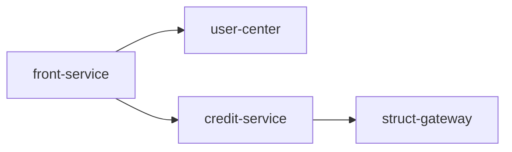
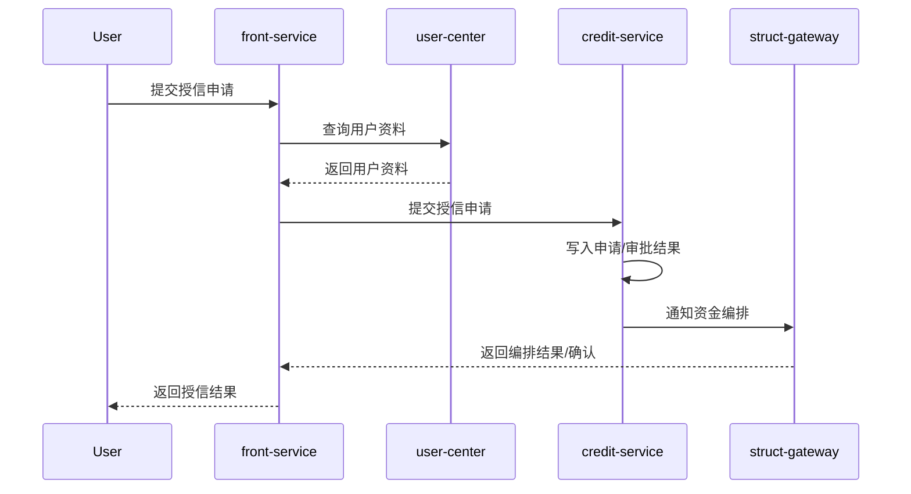

# Open Harness Hub 模式设计稿

> 版本：v0.1
> 日期：2026-04-06
> 目标：在不推翻现有 `oh:init` / `oh:propose` / `oh:apply` 工作流的前提下，补齐多服务知识聚合、系统全景视图、跨服务方案母稿三项能力。

---

## 1. 设计背景

当前 `Open Harness` 的初始化和方案生成默认面向**单个服务仓库**：

- `oh:init` 负责扫描当前仓库代码，生成该服务自己的 `knowledge/`
- `oh:propose` 负责基于当前仓库知识库生成 `docs/specs/active/{feature}/`
- `oh:apply` 负责在当前仓库落代码

这套模式适合“单服务内设计与实现”，但不直接覆盖以下场景：

- 一个核心业务链路穿过多个服务
- 需要在系统级看“谁负责什么、谁调用谁、关键流程怎么串起来”
- 需要先有一份跨服务方案，再下钻到各服务仓库分别落地

因此引入 **Hub 模式**：

- 服务仓库继续保留现有工作流
- 文档库新增 `--hub` 模式，只负责聚合事实和生成视图层
- 跨服务方案在文档库先产出“方案母稿”
- 各服务仓库再继续走现有 `oh:propose` / `oh:review` / `oh:apply` / `oh:verify`

---

## 2. 设计原则

1. **服务内事实，集中库视图**
   - 服务仓库产出本服务的事实文档
   - 文档库只做聚合和系统视图，不重新发明事实

2. **视图层独立于代码执行层**
   - Hub 模式生成系统图谱和跨服务方案
   - 代码实现仍在各服务仓库完成

3. **优先兼容现有命令**
   - 对用户入口优先使用 `oh:init --hub`、`oh:propose --hub`
   - 不引入新的主命令名

4. **半自动优先于全自动猜测**
   - 核心流程由 `flow-seeds.yaml` 显式声明
   - Agent 基于事实文档补全，不凭空推断所有流程

5. **先手工同步，再考虑自动化**
   - 第一版不依赖 CI 自动同步
   - 文档同步允许人工拷贝

---

## 3. 角色分工

### 3.1 服务仓库

负责产出本服务的事实层文档：

- `service-boundary.md`
- `domain-model.md`
- `api/`
- `database/`
- `service-meta.yaml`

### 3.2 文档库（Hub）

负责产出系统级视图层：

- `system-map.md`
- `core-flows/*.md`
- 跨服务 `design.md`
- `service-briefs/*.md`

### 3.3 方案执行层

各服务仓库继续沿用现有流程：

- `/oh:propose <name> <service-brief-path>`
- `/oh:review`
- `/oh:propose <name> --continue`
- `/oh:apply`

---

## 4. 文档库目录结构

建议 Hub 仓库采用以下结构：

```text
project-doc-hub/
├── CLAUDE.md
└── docs/
    ├── knowledge/
    │   ├── index.md
    │   ├── services/
    │   │   ├── front-service/
    │   │   │   ├── service-boundary.md
    │   │   │   ├── domain-model.md
    │   │   │   ├── service-meta.yaml
    │   │   │   ├── api/
    │   │   │   │   ├── index.md
    │   │   │   │   └── *.md
    │   │   │   └── database/
    │   │   │       ├── index.md
    │   │   │       └── *.md
    │   │   ├── credit-service/
    │   │   └── struct-gateway/
    │   └── system/
    │       ├── system-map.md
    │       ├── flow-seeds.yaml
    │       └── core-flows/
    │           ├── credit-apply.md
    │           ├── credit-approve.md
    │           └── loan-disbursement.md
    └── specs/
        ├── active/
        │   └── {feature}/
        │       ├── proposal.md
        │       ├── design.md
        │       └── service-briefs/
        │           ├── front-service.md
        │           ├── credit-service.md
        │           └── struct-gateway.md
        └── completed/
```

### 4.1 目录说明

- `docs/knowledge/services/`
  - 存放各服务同步过来的事实文档
- `docs/knowledge/system/`
  - 存放系统级视图与流程
- `docs/specs/active/{feature}/`
  - 存放跨服务需求的系统级方案母稿
- `service-briefs/`
  - 存放后续分发到各服务仓库使用的实施摘要

---

## 5. 服务事实层标准

每个服务在同步到 Hub 前，至少应提供以下内容。

### 5.1 必需文件

- `service-boundary.md`
- `domain-model.md`
- `service-meta.yaml`
- `api/index.md`
- `database/index.md`

`api/`、`database/` 明细文件可按服务实际情况补充。

### 5.2 `service-meta.yaml` 模板

```yaml
service: credit-service
display_name: 授信服务
domain: credit
role: domain
repo: git@company/credit-service.git
owners:
  - credit-team
upstreams:
  - front-service
downstreams:
  - user-center
  - struct-gateway
owned_data:
  - credit_application
  - credit_limit
published_events:
  - credit.approved
  - credit.rejected
consumed_events:
  - user.profile.updated
capabilities:
  - 授信申请受理
  - 授信审批决策
  - 额度管理
status_entities:
  - credit_application
```

### 5.3 字段约束

| 字段 | 必填 | 说明 |
|------|------|------|
| `service` | 是 | 目录名与服务唯一标识 |
| `display_name` | 是 | 面向业务读者的展示名 |
| `domain` | 是 | 业务域名称 |
| `role` | 是 | `gateway` / `orchestrator` / `domain` / `platform` |
| `repo` | 否 | 仓库地址 |
| `owners` | 是 | 维护团队 |
| `upstreams` | 否 | 上游服务列表 |
| `downstreams` | 否 | 下游服务列表 |
| `owned_data` | 否 | 主写数据实体/表 |
| `published_events` | 否 | 发布的业务事件 |
| `consumed_events` | 否 | 消费的业务事件 |
| `capabilities` | 是 | 服务核心能力标签 |

---

## 6. `oh:init --hub` 设计

## 6.1 命令定位

`oh:init --hub` 运行在**集中式文档库根目录**，只做视图层初始化与刷新。

它不是服务仓库版 `oh:init` 的简单复用，而是 `init` 的一个独立执行分支。

## 6.2 输入假设

命令执行前，Hub 仓库中已存在：

- `docs/knowledge/services/*/service-boundary.md`
- `docs/knowledge/services/*/domain-model.md`
- `docs/knowledge/services/*/service-meta.yaml`
- 可选：`docs/knowledge/services/*/api/`
- 可选：`docs/knowledge/services/*/database/`

若 `docs/knowledge/system/flow-seeds.yaml` 不存在，则初始化一个示例模板。

## 6.3 输出产物

- `docs/knowledge/system/system-map.md`
- `docs/knowledge/system/flow-seeds.yaml`（缺失时初始化示例模板）
- `docs/knowledge/system/core-flows/*.md`
- `docs/knowledge/index.md`
- `CLAUDE.md`（Hub 版导航，指向 system/ 与 services/）

## 6.4 非目标

Hub 模式下不生成以下内容：

- `docs/harness/`
- `docs/hooks/`
- 服务内约束文件
- 面向代码执行的 `docs/specs/` 骨架
- `.claude/settings.json` 的服务开发 hooks

说明：Hub 仓库不是代码执行仓库，不承担 `oh:apply` 职责。

## 6.5 执行步骤

1. 校验当前仓库存在 `docs/knowledge/services/`
2. 扫描 `services/*/service-meta.yaml`
3. 收集每个服务的：
   - 服务名
   - 业务域
   - 系统角色
   - 核心职责
   - 上下游
   - owned data
   - 核心能力
4. 生成 `system-map.md`
5. 检查 `flow-seeds.yaml`
   - 不存在则创建模板
   - 存在则读取已定义流程
6. 基于 `flow-seeds.yaml` 生成或刷新 `core-flows/*.md`
7. 刷新 `docs/knowledge/index.md`
8. 刷新 Hub 版 `CLAUDE.md`

---

## 7. `system-map.md` 设计

`system-map.md` 合并原本 `service-catalog` 与 `system-topology` 两个视图。

### 7.1 目标

用一份文档回答三个问题：

- 系统里有哪些服务
- 这些服务之间怎么连接
- 哪些是核心业务链路

### 7.2 模板

````markdown
# 系统全景图

> 生成时间：YYYY-MM-DD
> 信息来源：docs/knowledge/services/* 下的事实文档

---

## 1. 服务清单

| 服务 | 展示名 | 业务域 | 系统角色 | 核心职责 | Owner |
|------|--------|--------|----------|----------|-------|
| `front-service` | 前置服务 | loan-entry | gateway | 接入请求、参数适配、流程发起 | front-team |
| `credit-service` | 授信服务 | credit | domain | 授信申请、授信审批、额度管理 | credit-team |
| `struct-gateway` | 结构网关 | struct | orchestrator | 资方路由、产品编排、放款编排 | struct-team |

---

## 2. 服务拓扑

### 2.1 同步调用关系



### 2.2 异步事件关系

| 发布方 | 事件 | 消费方 | 业务含义 |
|--------|------|--------|----------|
| `credit-service` | `credit.approved` | `struct-gateway` | 授信通过后继续资金编排 |

### 2.3 高风险依赖

| 上游 | 下游 | 风险点 | 说明 |
|------|------|--------|------|
| `front-service` | `credit-service` | 同步强依赖 | 授信超时会直接影响前置链路 |

---

## 3. 核心链路索引

| 链路 | 触发入口 | 参与服务 | 详情 |
|------|----------|----------|------|
| 授信申请链路 | 用户发起授信申请 | `front-service` → `user-center` → `credit-service` → `struct-gateway` | [credit-apply.md](./core-flows/credit-apply.md) |
| 支用放款链路 | 用户发起支用 | `front-service` → `credit-service` → `struct-gateway` → `ledger-service` | [loan-disbursement.md](./core-flows/loan-disbursement.md) |
````

---

## 8. `flow-seeds.yaml` 设计

### 8.1 定位

`flow-seeds.yaml` 是核心流程的**显式声明文件**。

它的作用不是描述所有细节，而是告诉 Hub：

- 哪些流程值得生成 `core-flows/*.md`
- 每条流程的起点是什么
- 至少涉及哪些服务

### 8.2 模板

```yaml
flows:
  - id: credit-apply
    name: 授信申请链路
    trigger: 用户发起授信申请
    services:
      - front-service
      - user-center
      - credit-service
      - struct-gateway
    description: 从进件到授信审批及资金编排准备的主链路

  - id: loan-disbursement
    name: 支用放款链路
    trigger: 用户发起支用
    services:
      - front-service
      - credit-service
      - struct-gateway
      - ledger-service
    description: 从支用申请到放款落账的主链路
```

### 8.3 生成原则

- `id` 用作 `core-flows/{id}.md` 文件名
- `services` 是最小参与服务集，不要求严格有序
- 详细调用顺序由 Agent 基于事实文档补齐
- 无法确认的步骤必须标注 `<!-- TODO: 待确认 -->`

---

## 9. `core-flows/*.md` 生成设计

### 9.1 为什么不全自动生成

只靠 API、DB、服务边界文档，很难可靠识别“哪些流程才是核心链路”。

因此第一版采用：

- 人工维护 `flow-seeds.yaml`
- Agent 基于事实文档补全每条流程的明细

这是“半自动生成”。

### 9.2 输入来源

对每条 flow，读取以下内容：

- `docs/knowledge/system/flow-seeds.yaml`
- 涉及服务的 `service-meta.yaml`
- 涉及服务的 `service-boundary.md`
- 涉及服务的 `domain-model.md`
- 涉及服务的 `api/index.md`
- 涉及服务的 `database/index.md`

### 9.3 生成步骤

1. 读取 flow seed 中的 `id / name / trigger / services`
2. 收集涉及服务的事实文档
3. 识别：
   - 入口服务
   - 关键同步调用
   - 关键异步事件
   - 每个服务承担的业务动作
   - 主写数据归属
   - 幂等点
   - 失败兜底
4. 输出 `docs/knowledge/system/core-flows/{id}.md`
5. 将该 flow 回写到 `system-map.md` 的核心链路索引

### 9.4 模板

````markdown
# 授信申请链路

> flow-id: credit-apply
> 触发入口：用户发起授信申请
> 参与服务：front-service, user-center, credit-service, struct-gateway

---

## 1. 流程目标

在用户提交授信申请后，完成资料拉取、授信判断，并为后续资金编排提供决策结果。

## 2. 参与服务与职责

| 服务 | 角色 | 业务动作 |
|------|------|----------|
| `front-service` | 接入层 | 接收申请、参数校验、发起主流程 |
| `user-center` | 支撑域 | 提供用户资料和身份信息 |
| `credit-service` | 核心域 | 受理授信申请、执行授信审批、产出额度结果 |
| `struct-gateway` | 编排层 | 基于授信结果做资金方路由或产品编排 |

## 3. 主流程

1. `front-service` 接收授信申请并生成请求号
2. `front-service` 查询 `user-center` 获取申请所需用户资料
3. `front-service` 调用 `credit-service` 提交授信申请
4. `credit-service` 写入 `credit_application`
5. `credit-service` 完成审批判断并写入 `credit_limit`
6. `credit-service` 同步调用或异步通知 `struct-gateway`
7. `struct-gateway` 完成后续产品编排准备

## 4. 关键接口与事件

| 类型 | 发起方 | 名称 | 业务作用 |
|------|--------|------|----------|
| API | `front-service` | `POST /credit/apply` | 发起授信申请 |
| RPC | `front-service` | `UserFacade.queryProfile` | 获取用户资料 |
| RPC | `front-service` | `CreditFacade.submitApply` | 提交授信申请 |
| Event | `credit-service` | `credit.approved` | 授信通过事件 |

## 5. 数据归属

| 服务 | 主写数据 | 说明 |
|------|----------|------|
| `credit-service` | `credit_application`, `credit_limit` | 授信申请与额度结果主写 |

## 6. 幂等与补偿

### 6.1 幂等点

- 授信申请请求号
- 外部流水号

### 6.2 补偿点

- `struct-gateway` 编排失败时，是否需要回退授信状态：<!-- TODO: 待确认 -->

## 7. 异常兜底

| 场景 | 异常 | 兜底策略 |
|------|------|----------|
| 用户资料拉取失败 | `user-center` 超时 | 前置返回可重试错误码 |
| 授信结果落库失败 | DB 异常 | 记录失败状态并触发补偿任务 |

## 8. 时序图


````

---

## 10. `oh:propose --hub` 设计

## 10.1 定位

`oh:propose --hub <name> <prd-path>` 运行在文档库根目录，用于生成**跨服务方案母稿**。

它只负责系统级设计，不负责代码执行。

## 10.2 输入

- `<name>`：feature 名称
- `<prd-path>`：产品文档路径

读取以下知识：

- `docs/knowledge/system/system-map.md`
- `docs/knowledge/system/core-flows/*.md`
- `docs/knowledge/services/*/service-boundary.md`
- `docs/knowledge/services/*/domain-model.md`
- `docs/knowledge/services/*/service-meta.yaml`

## 10.3 输出

输出目录：

- `docs/specs/active/{name}/proposal.md`
- `docs/specs/active/{name}/design.md`
- `docs/specs/active/{name}/service-briefs/*.md`

## 10.4 与普通 `oh:propose` 的区别

| 维度 | 普通模式 | `--hub` 模式 |
|------|----------|--------------|
| 运行位置 | 服务仓库 | 文档库 |
| 目标 | 生成服务内可执行方案 | 生成跨服务方案母稿 |
| knowledge 来源 | 当前仓库 `docs/knowledge/` | Hub 下 `services/` + `system/` |
| 是否面向 `oh:apply` | 是 | 否 |
| 是否需要 `tasks.md` / `verification.md` | 通常需要 | 第一版不需要 |

## 10.5 输出文档要求

Hub 模式下的 `design.md` 应回答：

- 影响哪些服务
- 每个服务承担什么职责
- 需要新增或调整哪些接口/事件
- 数据边界如何划分
- 是否存在迁移、兼容、灰度、回滚风险

它不需要回答每个仓库内部的类、表、任务拆解细节。

## 10.6 `service-briefs/*.md`

Hub 模式必须为每个受影响服务生成一个实施摘要。

其作用是作为服务仓库后续执行普通 `oh:propose` 的输入。

### 模板

```markdown
# credit-apply — credit-service 实施摘要

> 来源：Hub 级 proposal + design
> 目标服务：credit-service

## 1. 服务目标

本次需求要求 `credit-service` 承担授信申请受理、审批决策、额度结果落库三项职责。

## 2. 本服务需要承担的变更

- 新增或调整授信申请受理能力
- 新增授信审批结果输出
- 必要时向 `struct-gateway` 发布授信结果

## 3. 上下游协同

- 上游：`front-service`
- 下游：`struct-gateway`

## 4. 关键契约

- 输入契约：前置传入授信申请参数
- 输出契约：授信审批结果、额度信息
- 事件契约：`credit.approved` / `credit.rejected`

## 5. 数据影响

- 主写数据：`credit_application`, `credit_limit`
- 存量迁移：不涉及 / <!-- TODO: 待确认 -->

## 6. 风险与待确认

- 结构网关失败后是否需要回退授信结果：<!-- TODO: 待确认 -->
```

---

## 11. 与现有工作流的串联

采用“方案 A”：

### 11.1 系统级方案先在文档库生成

```bash
cd project-doc-hub
/oh:init --hub
/oh:propose --hub credit-apply ./docs/prd/credit-apply.md
```

产出：

- 系统级 `design.md`
- `service-briefs/front-service.md`
- `service-briefs/credit-service.md`
- `service-briefs/struct-gateway.md`

### 11.2 再到各服务仓库生成可执行方案

```bash
cd front-service
/oh:propose credit-apply /abs/path/project-doc-hub/docs/specs/active/credit-apply/service-briefs/front-service.md

cd credit-service
/oh:propose credit-apply /abs/path/project-doc-hub/docs/specs/active/credit-apply/service-briefs/credit-service.md
```

说明：

- 现有 `oh:propose` 已支持 `<prd-path>` 为绝对路径
- 因此服务仓库侧无需修改命令入口
- 只是把“原始需求输入”替换为“Hub 生成的服务实施摘要”

### 11.3 服务仓库后续流程不变

每个受影响服务继续执行：

```bash
/oh:propose credit-apply ./service-briefs/credit-service.md
# 自动触发 /oh:review（Phase 1 文档）
/oh:propose credit-apply --continue
# 自动触发 /oh:review（Phase 2 文档）
/oh:apply
# 自动触发 /oh:review（apply 后综合 review）
/oh:verify   # 推荐：独立验收后再归档
```

---

## 12. 命令兼容性结论

### 12.1 `oh:init`

- 普通模式：服务仓库初始化
- `--hub` 模式：文档库视图层初始化

### 12.2 `oh:propose`

- 普通模式：服务级方案
- `--hub` 模式：系统级方案母稿

### 12.3 `oh:apply`

- 只运行在服务仓库
- Hub 仓库不提供 `oh:apply`

---

## 13. 第一版落地边界

第一版只做以下能力：

1. 服务事实文档集中管理
2. `system-map.md` 聚合视图
3. `flow-seeds.yaml` 驱动的 `core-flows/*.md`
4. `oh:init --hub`
5. `oh:propose --hub`
6. `service-briefs/*.md` 分发到各服务仓库

第一版暂不做：

- CI 自动同步
- Hub 仓库级别的 `tasks.md` / `verification.md`
- Hub 仓库级别的 `oh:apply`
- 全自动发现核心流程
- 自动在多个服务仓库批量触发 `oh:propose`

---

## 14. 后续实现建议

按以下顺序实施：

1. 增加 `oh:init --hub` 文档和命令分支
2. 增加 `flow-seeds.yaml` 初始化模板
3. 增加生成 `system-map.md` 的 Agent 或模板逻辑
4. 增加生成 `core-flows/*.md` 的 Agent
5. 增加 `oh:propose --hub`
6. 增加 `service-briefs/*.md` 生成逻辑

---

## 15. 一句话总结

Hub 模式的核心不是替代服务仓库工作流，而是补一层“系统视图 + 跨服务方案母稿”：

- 服务仓库负责事实和代码落地
- 文档库负责全景图和跨服务设计
- 两者通过 `service-briefs/*.md` 串起来
