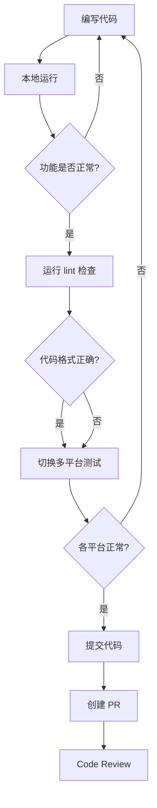

# fe-esflight 开发流程指南

> 适用于新入职前端实习生的全流程开发指南

---

## 目录

1. [项目概述](#1-项目概述)
2. [环境准备](#2-环境准备)
3. [项目启动](#3-项目启动)
4. [代码结构](#4-代码结构)
5. [开发规范](#5-开发规范)
6. [开发流程](#6-开发流程)
7. [常用命令](#7-常用命令)
8. [调试技巧](#8-调试技巧)
9. [常见问题](#9-常见问题)
10. [附录](#10-附录)

---

## 1. 项目概述

### 1.1 项目简介

**项目名称**: fe-esflight（机票业务前端）

**项目定位**: 滴滴企业版商旅平台的机票业务小程序，支持多端运行

### 1.2 技术栈

| 类别 | 技术 | 说明 |
|-----|------|-----|
| **核心框架** | MPX | 滴滴自研小程序跨平台框架，基于 Vue 2.7 |
| **UI 框架** | Vue 2.7.14 | 仅 H5 编译使用 |
| **构建工具** | Webpack 5.82.0 | 打包构建 |
| **状态管理** | @mpxjs/store | 类 Vuex 状态管理 |
| **请求库** | @didi/mpx-fetch | 统一请求封装 |
| **路由** | @didi/es-mpx-router | 路由管理 |
| **样式预处理** | Stylus | CSS 预处理器 |
| **代码规范** | ESLint + Prettier | 代码风格检查 |

### 1.3 支持平台

| 平台 | Mode | 产物目录 | 说明 |
|-----|------|---------|-----|
| 微信小程序 | `wx` | `dist/wx/` | 主流平台 |
| 滴滴小程序 | `dd` | `dist/dd/` | 内部使用 |
| 支付宝小程序 | `ali` | `dist/ali/` | 阿里系 |
| H5 Web | `web` | `dist/web/` | 移动端 H5 |
| 其他 | `swan/qq/tt/jd` | `dist/[mode]/` | 百度/QQ/抖音/京东 |

### 1.4 核心功能模块

```
├── 首页 (home)           # 航班搜索入口
├── 航班搜索 (search)     # 航班列表筛选
├── 航班详情 (flight-detail)  # 舱位选择
├── 创单 (make-order)     # 订单填写支付
├── 订单 (order)          # 订单列表详情
├── 改签 (change-ticket)  # 改签流程
├── 退票 (refund-ticket)  # 退票流程
└── 报销 (reimburse)      # 报销相关
```

---

## 2. 环境准备

### 2.1 环境要求

```bash
# Node.js 版本
node -v   # >= 16.0.0 (推荐 v18 LTS)

# npm 版本
npm -v    # >= 8.0.0

# 查看当前环境
node -v && npm -v
```

### 2.2 开发工具安装

#### 推荐 IDE
- **VSCode** - 推荐编辑器
  - 安装扩展: `Volar`, `ESLint`, `Prettier`, `Stylus`

#### 小程序开发者工具
| 平台 | 下载地址 | 配置项目路径 |
|-----|---------|-------------|
| 微信开发者工具 | https://developers.weixin.qq.com/miniprogram/dev/ | `dist/wx` |
| 滴滴开发者工具 | 内部渠道 | `dist/dd` |

### 2.3 环境变量（如需要）

```bash
# .env.development - 开发环境
API_BASE_URL=https://api-dev.example.com

# .env.production - 生产环境
API_BASE_URL=https://api.example.com
```

---

## 3. 项目启动

### 3.1 获取代码

```bash
# 1. 克隆仓库
git clone <repository-url>

# 2. 进入项目目录
cd fe-esflight

# 3. 查看分支
git branch -a
```

### 3.2 安装依赖

```bash
# 安装项目依赖（推荐使用 npm）
npm install

# 如果遇到 ENOBUFS 错误（缓冲区溢出），先运行
npm run preinstall

# 再次尝试安装
npm install
```

### 3.3 启动开发服务器

```bash
# 微信小程序开发模式（默认）
npm run watch

# 滴滴小程序开发模式
npm run watch:diminadev

# H5 开发模式
npm run watch:web

# 同时监听多个平台
npm run watch:cross
```

### 3.4 在开发者工具中预览

1. **微信小程序**
   - 打开微信开发者工具
   - 导入项目路径: `项目根目录/dist/wx`
   - 设置 AppID（如需）

2. **滴滴小程序**
   - 打开滴滴开发者工具
   - 导入项目路径: `项目根目录/dist/dd`

3. **H5**
   - 运行 `npm run watch:web`
   - 浏览器访问: `http://localhost:8080`（默认端口）

---

## 4. 代码结构

### 4.1 项目目录结构

```
fe-esflight/
├── src/                          # 源代码目录
│   ├── api/                      # API 接口定义
│   │   ├── base.js               # 基础配置
│   │   ├── order-edit.js        # 订单相关接口
│   │   ├── pay.js               # 支付相关接口
│   │   ├── urls.js             # 接口 URL 常量
│   │   └── ...
│   │
│   ├── components/               # 公共组件（69个）
│   │   ├── cabin-list/          # 舱位列表组件
│   │   │   ├── index.mpx
│   │   │   ├── cabin-card/      # 子组件
│   │   │   └── ...
│   │   ├── flight-card/         # 航班卡片
│   │   ├── order-bottom-bar/    # 订单底部栏
│   │   └── ...
│   │
│   ├── pages/                   # 页面文件
│   │   ├── home/                # 首页
│   │   │   ├── index.mpx        # 页面入口
│   │   │   ├── components/     # 页面私有组件
│   │   │   └── mixin/          # 页面私有 mixin
│   │   ├── search/              # 搜索列表页
│   │   ├── flight-detail/       # 航班详情页
│   │   ├── make-order/          # 创单页
│   │   ├── order/               # 订单页
│   │   ├── change-ticket/       # 改签页
│   │   ├── refund-ticket/        # 退票页
│   │   └── ...
│   │
│   ├── store/                   # 状态管理
│   │   ├── index.js             # Store 入口
│   │   ├── adapter/            # 适配器
│   │   └── modules/             # 模块目录
│   │       ├── user/            # 用户模块
│   │       ├── travel/          # 出行模块
│   │       ├── rule/            # 规则模块
│   │       ├── order/           # 订单模块
│   │       ├── makeOrder/       # 创单模块
│   │       ├── flightList/       # 航班列表模块
│   │       ├── common/          # 公共模块
│   │       ├── system/          # 系统模块
│   │       └── ...
│   │
│   ├── plugins/                 # 插件
│   │   ├── store.js            # 注入 $mpxStore
│   │   ├── router.js           # 路由配置
│   │   └── request.js          # 请求拦截器
│   │
│   ├── mixins/                 # 全局混入
│   │   ├── index.js            # Mixin 入口
│   │   └── stylus/             # 全局样式
│   │       ├── color.styl      # 颜色变量
│   │       ├── font.styl       # 字体变量
│   │       └── global.styl     # 全局工具类
│   │
│   ├── common/                 # 公共模块
│   │   ├── constant/           # 常量定义
│   │   │   └── env.js          # 环境判断常量
│   │   ├── enum/              # 枚举值
│   │   ├── track.js           # 埋点工具
│   │   └── ...
│   │
│   ├── utils/                  # 工具函数
│   │   ├── flight-storage.js  # 航班缓存
│   │   ├── storage.js         # 本地存储
│   │   ├── router.js          # 路由工具
│   │   └── ...
│   │
│   ├── app.mpx                # 应用入口
│   ├── appInit.js             # 应用初始化
│   └── index.html             # H5 HTML 模板
│
├── build/                      # 构建配置
│   ├── webpack.base.conf.js   # 基础 Webpack 配置
│   ├── webpack.dev.conf.js    # 开发环境配置
│   ├── webpack.prod.conf.js   # 生产环境配置
│   ├── build.js               # 构建入口脚本
│   ├── getPlugins.js          # 插件配置
│   └── getRules.js            # Loader 配置
│
├── config/                     # 配置文件
│   ├── index.js               # 主配置
│   ├── user.conf.js          # 用户配置（多端开关）
│   ├── defs.js               # 全局变量/API 代理
│   └── mpxLoader.conf.js     # Mpx Loader 配置
│
├── scripts/                    # 自定义脚本
├── docs/                       # 文档
├── test/                       # 测试文件
├── static/                     # 静态资源（多端适配）
│   ├── wx/                    # 微信小程序资源
│   ├── dd/                    # 滴滴小程序资源
│   └── ...
│
├── package.json
├── tsconfig.json
├── .eslintrc.js
├── .prettierrc.js
├── commitlint.config.js
└── jest.config.js
```

### 4.2 核心文件说明

| 文件 | 作用 |
|-----|------|
| `src/app.mpx` | 应用入口，配置全局组件、全局样式、应用生命周期 |
| `src/appInit.js` | 应用初始化逻辑（签名、埋点、权限、配置） |
| `src/store/index.js` | 状态管理入口，聚合所有 store 模块 |
| `src/plugins/router.js` | 页面路由配置 |
| `src/api/` | 所有接口定义，统一管理 API 请求 |
| `config/defs.js` | 全局变量（API 代理表、环境常量等） |

### 4.3 Store 模块职责

| 模块 | 路径 | 职责 |
|-----|------|-----|
| `user` | `store/modules/user/` | 用户信息、Token |
| `travel` | `store/modules/travel/` | 出行类型、差旅单、来源 |
| `rule` | `store/modules/rule/` | 差标规则、制度配置 |
| `order` | `store/modules/order/` | 订单信息、订单列表 |
| `makeOrder` | `store/modules/makeOrder/` | 创单状态（鉴权信息、航班数据） |
| `flightList` | `store/modules/flightList/` | 航班列表、筛选条件 |
| `flightDetail` | `store/modules/flightDetail/` | 航班详情 |
| `change` | `store/modules/change/` | 改签状态 |
| `common` | `store/modules/common/` | 公共状态（来源信息、Session） |
| `system` | `store/modules/system/` | 系统信息（设备信息等） |
| `customization` | `store/modules/customization/` | 主题色、定制化 |

---

## 5. 开发规范

### 5.1 Git 工作流

#### 分支命名规范

```bash
# 特性分支
feature/<功能描述>
例如: feature/order-detail-improve
例如: feature/add-refund-flow

# Bug 修复分支
fix/<问题描述>
例如: fix/search-page-crash
例如: fix/flight-list-white-screen

# 日常维护
chore/<描述>
例如: chore/update-dependencies
例如: chore/refactor-api-layer
```

#### 开发流程

```bash
# 1. 从 master 创建新分支
git checkout master
git pull origin master
git checkout -b feature/xxx

# 2. 开发代码

# 3. 提交代码（使用交互式提交）
npm run commit
# 或
npx git-cz

# 4. 推送分支
git push origin feature/xxx

# 5. 创建 Pull Request
# 在 GitLab/GitHub 页面创建 PR，等待 Code Review

# 6. 合并到 master（经 Code Review 后）
```

### 5.2 Commit 提交规范

使用 **Commitizen** 交互式提交：

```bash
# 触发交互式提交
npm run commit
```

**选择提交类型**：

| 类型 | 说明 | 示例 |
|-----|------|-----|
| `feat` | 新功能 | `feat: 添加订单筛选功能` |
| `fix` | 修复 Bug | `fix: 修复搜索页面白屏问题` |
| `docs` | 文档更新 | `docs: 更新 API 文档` |
| `style` | 代码格式（不影响功能） | `style: 格式化代码` |
| `refactor` | 重构 | `refactor: 重构订单模块结构` |
| `test` | 测试 | `test: 添加订单测试用例` |
| `chore` | 构建/工具 | `chore: 更新依赖版本` |

### 5.3 代码风格

#### ESLint 配置 (`.eslintrc.js`)

```javascript
// 项目使用 Standard 规范 + Mpx Vue 规则
module.exports = {
  extends: ['standard', 'plugin:mpx/vue'],
  rules: {
    // 示例规则
    'no-console': process.env.NODE_ENV === 'production' ? 'warn' : 'off'
  }
}
```

#### Prettier 配置 (`.prettierrc.js`)

```javascript
module.exports = {
  semi: false,           // 不使用分号
  singleQuote: true,      // 使用单引号
  arrowParens: 'avoid',   // 箭头函数单参数不加括号
  printWidth: 120        // 行宽 120
}
```

#### 自动格式化

```bash
# 修复代码格式问题
npm run lint:fix

# 检查但不修复
npm run lint:check

# Prettier 格式化
npm run format
```

### 5.4 命名规范

| 类型 | 规范 | 示例 |
|-----|------|-----|
| 页面目录 | kebab-case | `change-ticket`, `refund-ticket` |
| 组件目录 | kebab-case | `flight-card`, `cabin-list` |
| 组件文件 | `index.mpx` | `components/cabin-card/index.mpx` |
| Mixin 文件 | `-mixin.js` | `popup-mixin.js`, `request-mixin.js` |
| API 文件 | kebab-case | `flight-list.js`, `order-edit.js` |
| 工具函数 | kebab-case | `flight-storage.js` |
| CSS 类名 | kebab-case | `flight-card-wrap`, `price-info` |
| 变量/函数 | camelCase | `flightList`, `handleClick` |
| 常量 | UPPER_SNAKE_CASE | `MAX_COUNT`, `API_BASE_URL` |

---

## 6. 开发流程

### 6.1 新增页面

**步骤 1**: 创建页面目录

```
src/pages/
└── new-page/
    ├── index.mpx          # 页面入口
    ├── components/        # 页面私有组件（可选）
    ├── mixin/            # 页面私有 mixin（可选）
    └── logic/            # 页面私有逻辑（可选）
```

**步骤 2**: 编写页面文件

```html
<!-- src/pages/new-page/index.mpx -->
<script name="json">
  module.exports = {
    usingComponents: {
      // 页面级组件引入
      'flight-card': '@/components/flight-card/index'
    }
  }
</script>

<template>
  <view class="new-page">
    <flight-card detail="{{flightInfo}}" />
    <button bindtap="handleClick">点击</button>
  </view>
</template>

<script>
  import { createPage } from '@didi/es-mpx-creator'

  createPage({
    // 页面数据
    data() {
      return {
        flightInfo: {}
      }
    },

    // 计算属性
    computed: {
      ...store.mapState({
        userInfo: 'user.userInfo'
      })
    },

    // 监听器
    watch: {
      flightInfo(newVal) {
        console.log('航班信息变化:', newVal)
      }
    },

    // 页面生命周期
    onLoad(options) {
      console.log('页面参数:', options)
      this.initData(options)
    },

    onShow() {
      // 每次显示时调用
    },

    onReady() {
      // 渲染完成
    },

    // 方法
    methods: {
      initData(options) {
        // 初始化数据
      },

      handleClick() {
        console.log('点击事件')
      }
    }
  })
</script>

<style lang="stylus" scoped>
.new-page
  padding 20rpx
  background #f5f5f5
</style>
```

**步骤 3**: 配置路由

路由配置在 `src/plugins/router.js` 或各页面的 `app.mpx` 配置中：

```javascript
// pages 属性中添加
pages: [
  // ...
  {
    path: '/pages/new-page/index',
    name: 'newPage'
  }
]
```

### 6.2 新增组件

**步骤 1**: 创建组件目录

```
src/components/
└── my-component/
    └── index.mpx          # 组件入口
```

**步骤 2**: 编写组件文件

```html
<!-- src/components/my-component/index.mpx -->
<script name="json">
  module.exports = {
    component: true,  // 必须声明为组件
    usingComponents: {}  // 如有子组件
  }
</script>

<template>
  <view class="my-component">
    <text>{{ title }}</text>
    <slot></slot>
  </view>
</template>

<script>
  import { createComponent } from '@didi/es-mpx-creator'

  createComponent({
    // 接收外部属性
    props: {
      title: {
        type: String,
        default: '默认标题'
      },
      // 多类型
      data: [Object, Array],
      // 必须属性
      requiredProp: {
        type: String,
        required: true
      }
    },

    // 组件数据
    data() {
      return {
        internalValue: ''
      }
    },

    // 计算属性
    computed: {},

    // 监听器
    watch: {},

    // 组件生命周期
    created() {
      // 实例创建
    },

    attached() {
      // 进入节点树
    },

    ready() {
      // 渲染完成
    },

    detached() {
      // 离开节点树
    },

    // 方法
    methods: {
      handleClick() {
        // 向父组件触发事件
        this.triggerEvent('click', {
          value: this.internalValue
        })
      }
    },

    // 外部样式类
    externalClasses: ['custom-class', 'title-class']
  })
</script>

<style lang="stylus" scoped>
.my-component
  padding 20rpx
  background #fff

  .title-class
    font-size 16px
</style>
```

**步骤 3**: 在页面中使用

```html
<!-- 在其他文件中引入 -->
<import src="@/components/my-component/index.mpx" />

<template>
  <view>
    <!-- 使用组件 -->
    <my-component
      title="自定义标题"
      data="{{myData}}"
      custom-class="my-custom-class"
      bind:click="onComponentClick"
    >
      <!-- 插槽内容 -->
      <text>插槽内容</text>
    </my-component>
  </view>
</template>
```

### 6.3 新增 API 接口

**步骤 1**: 在 `src/api/` 下创建或编辑接口文件

```javascript
// src/api/my-feature.js
import mpx from '@mpxjs/core'

// 接口基础路径（来自 urls.js）
import { API_BASE_URL } from './urls'

// GET 请求
export const getFlightList = (params) =>
  mpx.$http.get('/flight/list', { params })

// POST 请求
export const createOrder = (data) =>
  mpx.$http.post('/order/create', { data })

// 带拦截器配置的请求
export const getDetail = (id) =>
  mpx.$http.post('/flight/detail', {
    data: { id },
    headers: { 'Content-Type': 'application/json' }
  })
```

**步骤 2**: 在需要的地方引入

```javascript
import { getFlightList, createOrder } from '@/api/my-feature'

// 在方法中使用
methods: {
  async fetchFlights() {
    const list = await getFlightList({ page: 1, size: 10 })
    this.setData({ flightList: list })
  }
}
```

### 6.4 新增 Store 模块

**步骤 1**: 创建模块目录

```
src/store/modules/
└── myModule/
    ├── index.js      # 模块入口
    ├── state.js      # 状态定义
    ├── mutations.js  # 同步方法
    └── actions.js    # 异步方法（可选）
```

**步骤 2**: 编写模块文件

```javascript
// state.js
export default {
  data: null,
  list: [],
  loading: false
}

// mutations.js
export default {
  setData(state, payload) {
    state.data = payload
  },
  setList(state, list) {
    state.list = list
  },
  setLoading(state, loading) {
    state.loading = loading
  }
}

// actions.js（可选）
export default {
  async fetchData({ commit }) {
    commit('setLoading', true)
    try {
      const res = await getDataAPI()
      commit('setData', res.data)
      commit('setLoading', false)
    } catch (err) {
      commit('setLoading', false)
      throw err
    }
  }
}

// index.js - 模块入口
import { createStore } from '@didi/es-mpx-creator'
import state from './state'
import mutations from './mutations'
import actions from './actions'

const myModule = createStore({
  state,
  mutations,
  actions
})

export default myModule
```

**步骤 3**: 在组件中使用

```javascript
// 方式 1: mapState
computed: {
  ...store.mapState({
    myData: 'myModule.data',
    myList: 'myModule.list'
  })
}

// 方式 2: 直接访问
this.$mpxStore.state.myModule.data

// 提交 mutation
store.commit('myModule/setData', newData)

// 调用 action
store.dispatch('myModule/fetchData')
```

### 6.5 新增 Mixin

**步骤 1**: 创建 mixin 文件

```javascript
// src/mixins/my-mixin.js
export default {
  data() {
    return {
      mixinData: 'mixin data'
    }
  },

  computed: {
    mixinComputed() {
      return this.mixinData + '_computed'
    }
  },

  methods: {
    mixinMethod() {
      console.log('mixin method called')
    }
  },

  // 页面生命周期（可选）
  onLoad() {
    console.log('mixin onLoad')
  }
}
```

**步骤 2**: 在页面/组件中使用

```javascript
import myMixin from '@/mixins/my-mixin'

createPage({
  mixins: [myMixin],

  onLoad() {
    // mixin 的 onLoad 会先执行
    console.log('page onLoad')
  },

  methods: {
    // 组件自身方法会覆盖 mixin 的
    mixinMethod() {
      console.log('page method called')
    }
  }
})
```

### 6.6 开发自测流程



---

## 7. 常用命令

### 7.1 安装与依赖

```bash
# 安装依赖
npm install

# 修复依赖问题（如 ENOBUFS）
npm run preinstall

# 更新依赖
npm update

# 查看可更新依赖
npm outdated
```

### 7.2 开发调试

```bash
# 微信小程序开发模式（默认）
npm run watch

# 滴滴小程序开发模式
npm run watch:diminadev

# H5 开发模式
npm run watch:web

# 多平台同时监听
npm run watch:cross

# 生产环境构建（用于测试）
npm run build

# 开发环境构建
npm run build:dev

# 滴滴小程序构建
npm run build:dimina

# 多平台构建
npm run build:cross
```

### 7.3 代码检查

```bash
# ESLint 检查
npm run lint

# ESLint 修复
npm run lint:fix

# 严格模式检查
npm run lint:check

# Prettier 格式化
npm run format

# 单元测试
npm run test

# 运行所有检查
npm run check
```

### 7.4 提交相关

```bash
# 交互式提交
npm run commit

# 或直接使用
npx git-cz

# 查看 git 状态
git status

# 查看修改内容
git diff

# 添加文件到暂存区
git add .

# 查看提交历史
git log --oneline -10
```

---

## 8. 调试技巧

### 8.1 Console 调试

```javascript
// 基本日志
console.log('debug info')

// 对象输出
console.log('data:', JSON.stringify(this.data))

// 警告和错误
console.warn('warning message')
console.error('error message')

// 分组输出
console.group('请求信息')
console.log('url:', url)
console.log('params:', params)
console.groupEnd()
```

### 8.2 小程序开发者工具调试

| 平台 | 调试工具 | 说明 |
|-----|---------|-----|
| 微信小程序 | 微信开发者工具 | Sources 面板断点调试 |
| 滴滴小程序 | 滴滴开发者工具 | Console + Sources |
| H5 | 浏览器 DevTools | Network + Elements |

### 8.3 Network 请求调试

```javascript
// 在 request.js 插件中查看请求日志
// 请求拦截器会打印请求信息

// 查看接口响应
// 微信开发者工具 -> Network -> 筛选接口
```

### 8.4 状态调试

```javascript
// 在页面中打印 data
console.log('current data:', this.data)

// 查看 store 状态
console.log('store state:', this.$mpxStore.state)

// 在 onLoad 中打印 options
onLoad(options) {
  console.log('页面参数:', options)
}
```

### 8.5 跨平台调试注意

```javascript
// 平台判断
if (__mpx_mode__ === 'web') {
  // H5 环境
  console.log('H5 环境')
} else if (__mpx_mode__ === 'dd') {
  // 滴滴小程序
  console.log('滴滴小程序')
} else if (__mpx_mode__ === 'wx') {
  // 微信小程序
  console.log('微信小程序')
}
```

---

## 9. 常见问题

### 9.1 编译错误

**ENOBUFS 错误**
```bash
# 解决方案
npm run preinstall
npm install
```

**Mpx 编译报错**
- 检查 `.mpx` 文件语法
- 确保使用正确的 `createPage` / `createComponent`
- 检查 import 路径是否正确

**样式不生效**
- 确认样式文件被正确引入
- 检查是否有 `scoped` 样式泄漏
- 确认预处理器语法正确

### 9.2 运行问题

**端口被占用**
```bash
# 查看端口占用
lsof -i :8080

# 杀掉进程
kill -9 <PID>
```

**Node 版本不兼容**
```bash
# 使用 nvm 切换 Node 版本
nvm use 18
```

### 9.3 接口问题

**接口 404**
- 检查 `config/defs.js` 中的 API 代理配置
- 确认接口 URL 正确
- 检查网络请求是否被正确拦截

**接口超时**
- 检查网络环境
- 确认后端服务是否正常运行
- 查看请求超时配置

### 9.4 样式问题

**样式覆盖**
- 使用 `scoped` 样式隔离
- 使用更具体的选择器
- 避免使用 `!important`

**跨平台样式差异**
```stylus
// 针对不同平台使用条件编译
if __mpx_mode__ == 'web'
  .container
    padding 20px
else
  .container
    padding 20rpx
```

---

## 10. 附录

### 10.1 关键配置文件

| 配置项 | 文件路径 |
|--------|----------|
| ESLint | `.eslintrc.js` |
| Prettier | `.prettierrc.js` |
| TypeScript | `tsconfig.json` |
| Commit 规范 | `commitlint.config.js` |
| Jest 测试 | `jest.config.js` |
| 项目配置 | `project.config.json` |
| Mpx 插件 | `config/mpxPlugin.conf.js` |
| Webpack 基础 | `build/webpack.base.conf.js` |
| 用户配置 | `config/user.conf.js` |
| 全局变量 | `config/defs.js` |

### 10.2 技术资料

- [MPX 官方文档](https://didi.github.io/mpx/)
- [MPX GitHub](https://github.com/didi/mpx)
- [Vue 2 文档](https://v2.vuejs.org/)
- [滴滴企业级组件库](https://github.com/didi/es-mpx-ui)

### 10.3 联系人

如遇到问题，请咨询：
- 项目负责人: [请联系导师]
- 技术 Leader: [请联系导师]

---

> 祝开发顺利！如果有任何问题，请及时请教。