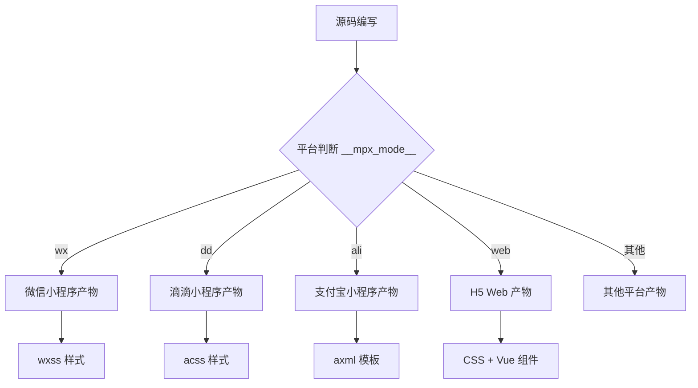
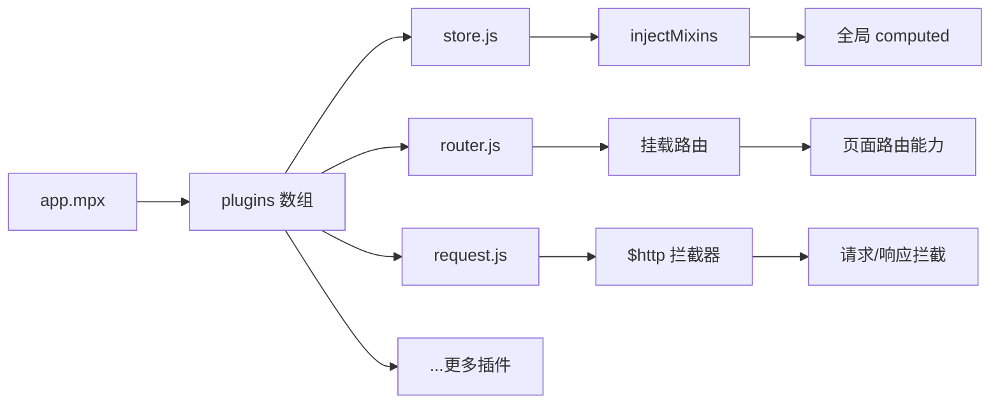
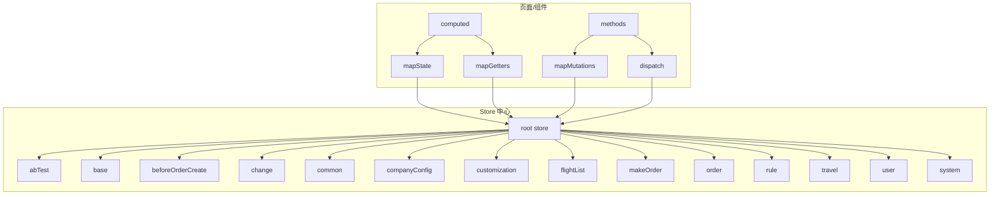
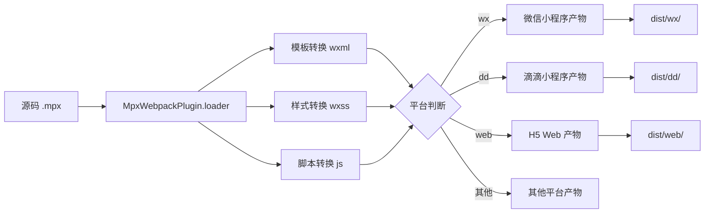

# mpx-architecture

## 1. 架构全景图

## 答案

```
┌─────────────────────────────────────────────────────────────────┐
│                         用户层                                  │
│                    (小程序 / H5 / Web)                          │
└─────────────────────────────────────────────────────────────────┘
                                  │
                                  ▼
┌─────────────────────────────────────────────────────────────────┐
│                        应用层 (app.mpx)                         │
│  ┌──────────┐  ┌──────────┐  ┌──────────┐  ┌──────────────────┐│
│  │ Plugins   │  │ Mixins   │  │ Store    │  │ GlobalConfig     ││
│  │ 插件系统  │  │ 混入机制 │  │ 状态管理  │  │ 全局配置         ││
│  └──────────┘  └──────────┘  └──────────┘  └──────────────────┘│
└─────────────────────────────────────────────────────────────────┘
                                  │
                                  ▼
┌─────────────────────────────────────────────────────────────────┐
│                       页面 / 组件层                              │
│  ┌────────────────┐        ┌────────────────┐                  │
│  │   pages/       │        │  components/   │                  │
│  │   页面模块      │        │  公共组件       │                  │
│  └────────────────┘        └────────────────┘                  │
└─────────────────────────────────────────────────────────────────┘
                                  │
                                  ▼
┌─────────────────────────────────────────────────────────────────┐
│                      基础设施层                                  │
│  ┌──────────┐  ┌──────────┐  ┌──────────┐  ┌──────────────────┐│
│  │ API      │  │ Store    │  │ Utils    │  │ Common           ││
│  │ 接口层    │  │ 状态模块  │  │ 工具函数  │  │ 公共模块         ││
│  └──────────┘  └──────────┘  └──────────┘  └──────────────────┘│
└─────────────────────────────────────────────────────────────────┘
                                  │
                                  ▼
┌─────────────────────────────────────────────────────────────────┐
│                      构建层 (Webpack + MPX)                     │
│  ┌──────────────────┐    ┌──────────────────┐    ┌────────────┐ │
│  │ MpxWebpackPlugin │    │ Loader 转换器    │    │ 插件/预处  │ │
│  │ 多端代码生成      │    │ mpx→wxml/wxss   │    │ 理器       │ │
│  └──────────────────┘    └──────────────────┘    └────────────┘ │
└─────────────────────────────────────────────────────────────────┘
                                  │
                                  ▼
┌─────────────────────────────────────────────────────────────────┐
│                      输出层 (多端产物)                          │
│  ┌────────┐  ┌────────┐  ┌────────┐  ┌────────┐  ┌────────────┐ │
│  │ 微信    │  │ 滴滴    │  │ 支付宝  │  │ H5     │  │ 其他平台   │ │
│  │ 小程序  │  │ 小程序  │  │ 小程序  │  │ Web    │  │           │ │
│  └────────┘  └────────┘  └────────┘  └────────┘  └────────────┘ │
└─────────────────────────────────────────────────────────────────┘
```

---

## 2. 多端编译架构

## 答案

**### 2.1 多端支持矩阵**

| 平台 | Mode 标识 | 产物后缀 | 特性支持 |
|-----|---------|---------|---------|
| 微信小程序 | `wx` | `.wxss` | 全部支持 |
| 滴滴小程序 | `dd` | `.acss` | 全部支持 |
| 支付宝小程序 | `ali` | `.axml` | 部分定制 |
| H5 Web | `web` | `.css` / `.vue` | Vue 2.7 编译 |
| 百度小程序 | `swan` | `.swan` | 部分定制 |
| QQ 小程序 | `qq` | `.qml` | 部分定制 |
| 字节跳动 | `tt` | `.ttml` | 部分定制 |
| 京东小程序 | `jd` | `.jdml` | 部分定制 |

**### 2.2 条件编译机制**



**### 2.3 平台判断常量**

```javascript
// 文件: src/common/constant/env.js

// 环境判断
export const IS_H5 = __mpx_mode__ === 'web'     // H5环境
export const IS_DIMINA = __mpx_mode__ === 'dd'  // 滴滴小程序(星河)
export const IS_WX = __mpx_mode__ === 'wx'     // 微信小程序
export const IS_ALI = __mpx_mode__ === 'ali'    // 支付宝小程序

// 调试模式
export const IS_DEBUG = process.env.NODE_ENV !== 'production'

// 在线环境
export const IS_ONLINE = IS_H5_ONLINE || IS_DIMINA_ONLINE
```

**### 2.4 条件编译使用示例**

```javascript
// 1. 平台特定包引入
// app.mpx
if (__mpx_mode__ !== 'web') {
  config.packages.push('@didi/fe-escontact/src/app.mpx?root=contact')
} else {
  config.packages.push('@didi/fe-escontact/src/app.mpx?root=contact&independent=true')
}

// 2. 代码中的平台判断
// order-create.mpx
this.isDiDiMode = __mpx_mode__ === 'dd'

// 3. 静态资源多端适配
// /static/
//   ├── wx/      # 微信小程序资源
//   ├── dd/      # 滴滴小程序资源
//   └── ali/     # 支付宝小程序资源
```

**### 2.5 平台配置**

```javascript
// config/user.conf.js
module.exports = {
  srcMode: formatOption("wx"),    // 源码默认模式
  cross: formatOption("true"),    // 跨平台编译
  transWeb: formatOption("true"),  // 支持输出 Web/H5
}

// 支持同时编译多个平台
// npm run watch --mode=wx,dd,web
```

---

## 3. 插件系统

## 答案

**### 3.1 插件架构图**



**### 3.2 插件注册机制**

```javascript
// app.mpx
import { createApp } from '@didi/es-mpx-creator'
import mixins from '@/mixins/index'
import usex from '@didi/es-mpx-usex'

// 自动加载 plugins/ 目录下所有插件
function getPlugins() {
  const context = require.context('@/plugins', true, /\.js$/)
  return context.keys().map((path) => context(path).default)
}

createApp({
  plugins: [mixins, usex, ...getPlugins()],
  globalData: { ... }
})
```

**### 3.3 插件开发范式**

```javascript
// src/plugins/store.js 示例
import store from '@/store'

export default (app) => {
  // injectMixins: 向指定类型组件注入 mixin
  app.injectMixins(
    {
      computed: {
        $mpxStore() {
          return store
        }
      }
    },
    'page'  // 仅在 page 中生效，可选 'component'
  )
}

// src/plugins/request.js 示例
function fetchProxy(app, config) {
  // app.use: 向应用实例注入代理方法
  app.use((proxy) => {
    const { createRequest } = require('@didi/mpx-fetch')

    // 注入 $http
    proxy.$http = createRequest({
      // 请求配置
      timeout: 10000,
      header: {
        'Content-Type': 'application/json'
      }
    })

    // 注入 $fetch (别名)
    proxy.$fetch = proxy.$http
  })
}

export default fetchProxy
```

**### 3.4 核心插件说明**

| 插件 | 文件 | 作用 |
|-----|------|-----|
| store | `plugins/store.js` | 注入 `$mpxStore` 到页面 |
| router | `plugins/router.js` | 配置页面路由能力 |
| request | `plugins/request.js` | 配置请求拦截器 |
| usex | `@didi/es-mpx-usex` | 增强状态管理能力 |

---

## 4. 状态管理架构

## 答案

**### 4.1 状态管理架构图**



**### 4.2 Store 模块划分**

| 模块 | 路径 | 职责 |
|-----|------|-----|
| user | `store/modules/user/` | 用户信息、Token |
| travel | `store/modules/travel/` | 出行类型、差旅单 |
| rule | `store/modules/rule/` | 差标规则、制度 |
| order | `store/modules/order/` | 订单信息、状态 |
| makeOrder | `store/modules/makeOrder/` | 创单状态、鉴权信息 |
| flightList | `store/modules/flightList/` | 航班列表、筛选条件 |
| flightDetail | `store/modules/flightDetail/` | 航班详情 |
| change | `store/modules/change/` | 改签状态 |
| common | `store/modules/common/` | 来源信息、Session |
| system | `store/modules/system/` | 系统信息、设备信息 |
| customization | `store/modules/customization/` | 主题色、定制化配置 |

**### 4.3 Store 入口实现**

```javascript
// src/store/index.js
import { createStore } from '@didi/es-mpx-creator'
import { positionStore } from '@didi/es-mpx-usex'

// 自动导入 modules/ 下所有模块
function importAll(context) {
  return context.keys().reduce((target, path) => {
    const match = path.match(/^\.\/([^\/]+)\//)
    if (match[1]) {
      target[match[1]] = context(path).default
    }
    return target
  }, {})
}

export const root = importAll(require.context('./modules/', true, /index\.js$/))

export default createStore({
  deps: root  // deps = 多模块联合
})
```

**### 4.4 单个模块结构**

```
store/modules/order/
├── index.js      # 模块入口
├── state.js       # 状态定义
├── mutations.js   # 突变方法
├── actions.js    # 异步Action (如有)
└── getters.js    # 计算属性 (如有)
```

```javascript
// state.js
export default {
  orderDetail: {},
  orderStatus: '',
  orderList: []
}

// mutations.js
export default {
  setOrderDetail(state, payload) {
    state.orderDetail = payload
  },
  setOrderStatus(state, status) {
    state.orderStatus = status
  }
}
```

**### 4.5 组件中使用 Store**

```javascript
// 1. mapState - 映射 state 到 computed
computed: {
  ...store.mapState({
    userInfo: 'user.userInfo',      // 直接访问 user 模块的 userInfo
    flightConfig: 'flightList.config',
    isIntlCity: (state) => state.travel.isIntlCity  // 自定义访问器
  })
}

// 2. mapGetters - 映射 getters
computed: {
  ...store.mapGetters({
    institution: 'rule.institution',
    onlyBookingForSelf: 'rule.onlyBookingForSelf'
  })
}

// 3. mapMutations - 映射 mutations 到 methods
methods: {
  ...store.mapMutations({
    setUserInfo: 'user.setUserInfo',
    setOrderDetail: 'order.setOrderDetail'
  }),

  // 使用
  updateUser(data) {
    this.setUserInfo(data)  // 相当于 store.commit('user/setUserInfo', data)
  }
}

// 4. dispatch action
methods: {
  async fetchOrderDetail(orderId) {
    const detail = await store.dispatch('order/fetchDetail', orderId)
    this.orderDetail = detail
  }
}
```

**### 4.6 跨模块通信**

```javascript
// 模块间调用
store.dispatch('makeOrder.setFlightDetail', data)

// 通过 getter 获取其他模块数据
// getters.js
export default {
  // 获取 user 模块的 token
  token: (state, getters, rootState) => rootState.user.token
}
```

---

## 5. 组件生态

## 答案

**### 5.1 组件分层架构**

```mermaid
flowchart TD
    subgraph UI["UI 组件层"]
        A[@didi/es-mpx-ui]
        B[@didi/es-mpx-ui/icons]
    end

    subgraph Business["业务组件层"]
        C[flight-card]
        D[cabin-list]
        E[order-bottom-bar]
    end

    subgraph Pages["页面组件层"]
        F[order-create 私有组件]
        G[home 私有组件]
    end

    A --> B
    A --> C
    C --> D
    D --> E
    E --> F
    F --> G
```

**### 5.2 全局组件注册**

```javascript
// app.mpx - 全局注册
import { createApp } from '@didi/es-mpx-creator'

createApp({
  usingComponents: {
    // 基础 UI 组件
    'es-icon': '@didi/es-mpx-ui/lib/icon',
    'es-layout': '@didi/es-mpx-ui/lib/layout/index',
    'es-drawer-bottom': '@didi/es-mpx-ui/lib/drawer-bottom',
    'es-card-wrap1': '@didi/es-mpx-ui/lib/card/card-wrap1',
    'es-descriptions': '@didi/es-mpx-ui/lib/descriptions',
    'es-cell': '@didi/es-mpx-ui/lib/cell',

    // 布局组件
    'es-scrollable': '@didi/es-mpx-ui/lib/scrollable',
    'es-safe-area': '@didi/es-mpx-ui/lib/safe-area'
  }
})
```

**### 5.3 页面级组件按需引入**

```javascript
// pages/share/index.mpx
<script name="json">
  module.exports = {
    component: true,
    usingComponents: {
      // 仅在该页面使用的组件
      'es-card': '@didi/es-mpx-ui/lib/card/index',
      'es-layout': '@didi/es-mpx-ui/lib/scroll-layout',
      'skeleton': '@/components/list-skeleton/index'
    }
  }
</script>
```

**### 5.4 组件使用示例**

```html
<!-- 布局组件 -->
<es-layout
  layout="{{['header', 'footer']}}"
  custom-class="{{homeMainClass}}"
  use-default-navbar="{{false}}"
>
  <view slot="header">导航栏内容</view>
  <view>页面主体内容</view>
  <view slot="footer">底部内容</view>
</es-layout>

<!-- 图标组件 -->
<es-icon name="exclamation-circle" size="14" color="#E5723A" />

<!-- 卡片组件 -->
<es-card-wrap1 custom-class="card-wrap">
  <view slot="content">卡片内容</view>
</es-card-wrap1>

<!-- 业务组件 -->
<cabin-card
  cabinDetail="{{item}}"
  cabinIndex="{{idx}}"
  bind:handleOrder="onHandleOrder"
/>
```

**### 5.5 组件库依赖**

| 依赖 | 版本 | 作用 |
|-----|------|-----|
| `@didi/es-mpx-ui` | 0.1.305 | 企业级 UI 组件库 |
| `@didi/es-mpx-creator` | 0.1.18 | 组件创建器 |
| `@didi/es-control-mpx-ui` | - | 管控组件（审批人、成本中心选择） |
| `@didi/es-flight-foundation` | - | 航班业务基础工具 |

---

## 6. 构建体系

## 答案

**### 6.1 构建流程图**



**### 6.2 Webpack 配置架构**

```javascript
// build/webpack.base.conf.js
module.exports = {
  resolve: {
    extensions: ['.mpx', '.js', '.wxml', '.vue', '.ts', '.styl'],
    alias: {
      '@': resolve('src'),
      'creator': resolve('src/index', 'application'),
      'mixins': resolve('src/index', 'mixins'),
      '@didi/mpx': '@mpxjs/core'
    }
  },

  cache: {
    type: 'filesystem',
    cacheDirectory: resolve('.cache/'),
    version: '1.0.2'  // 构建配置变更时需更新
  }
}
```

**### 6.3 MpxWebpackPlugin 配置**

```javascript
// build/getPlugins.js
const MpxWebpackPlugin = require('@mpxjs/webpack-plugin')

new MpxWebpackPlugin({
  mode,           // 编译目标平台 wx/dd/ali/web
  srcMode,        // 源码原始平台 wx
  autoSplit: true, // 启用自动代码分割
  cross: true,     // 启用跨平台编译
  transWeb: true   // 支持 Web 输出
})
```

**### 6.4 Loader 配置**

```javascript
// build/getRules.js

// Web 模式 (需要 vue-loader)
{
  test: /\.mpx$/,
  use: [
    { loader: 'vue-loader' },
    MpxWebpackPlugin.loader(currentMpxLoaderConf)
  ]
}

// 非 Web 模式 (小程序)
{
  test: /\.mpx$/,
  use: MpxWebpackPlugin.loader(currentMpxLoaderConf)
}

// 样式转换
{
  test: /\.styl(us)?$/,
  use: [
    MpxWebpackPlugin.wxssLoader(),  // 输出 wxss/acss
    { loader: 'stylus-loader' }
  ]
}

// 模板转换
{
  test: /\.(wxml|axml|swan|ttml|qml|jdml)$/,
  use: MpxWebpackPlugin.wxmlLoader()
}
```

**### 6.5 多端构建命令**

```bash
# 构建微信小程序
npm run build:wx

# 构建滴滴小程序
npm run build:dd

# 构建 H5 Web
npm run build:web

# 同时构建多端
npm run watch --mode=wx,dd,web
```

---

## 7. 性能优化

## 答案

**### 7.1 代码分割策略**

```javascript
// build/getWebpackConf.js
optimization: {
  splitChunks: {
    cacheGroups: {
      // 第三方库分割
      vendor: {
        name: 'vendor',
        filename: '[name].[contenthash:6].js',
        test: /[\\/]node_modules[\\/]/,
        chunks: 'initial',
        priority: 10
      },

      // 公共模块分割
      common: {
        name: 'common',
        filename: '[name].[contenthash:6].js',
        test: /[\\/]src[\\/](common|components)[\\/]/,
        chunks: 'initial',
        minChunks: 2
      }
    }
  }
}
```

**### 7.2 平台资源过滤**

```javascript
// build/getPlugins.js

// 忽略其他平台的静态资源
const copyIgnoreArr = supportedModes.map((item) => `**/${item}/**`)

CopyWebpackPlugin({
  patterns: [{
    context: resolve('static'),
    from: '**/*',
    globOptions: {
      ignore: copyIgnoreArr  // 只复制当前平台需要的资源
    }
  }]
})
```

**### 7.3 文件缓存策略**

```javascript
// webpack.base.conf.js
cache: {
  type: 'filesystem',
  cacheDirectory: resolve('.cache/'),
  version: '1.0.2'  // 修改构建配置后更新 version
}
```

**### 7.4 编译优化**

```javascript
// mpxLoader.conf.js
module.exports = {
  transform: {
    optimize: true  // 启用优化转换
  },
  loaders: {
    // 使用 cssnano 压缩 CSS
    css: {
      loader: 'css-loader',
      options: {
        minimize: true
      }
    }
  }
}
```

---

## 8. 工程规范

## 答案

**### 8.1 项目结构规范**

```
src/
├── app.mpx                 # 应用入口 (必须)
├── appInit.js              # 应用初始化逻辑
│
├── api/                     # 接口定义
│   ├── base.js             # 基础配置
│   ├── flight.js           # 航班相关
│   ├── order.js            # 订单相关
│   └── ...
│
├── components/              # 公共组件
│   ├── flight-card/        # 航班卡片
│   │   ├── index.mpx       # 组件入口
│   │   └── cabin-card/    # 子组件
│   └── ...
│
├── pages/                   # 页面
│   ├── home/               # 首页
│   │   ├── index.mpx       # 页面入口
│   │   ├── components/     # 页面私有组件
│   │   ├── mixin/          # 页面私有 mixin
│   │   └── logic/          # 页面私有逻辑
│   ├── flight-detail/      # 详情页
│   ├── make-order/         # 创单页
│   └── ...
│
├── store/                   # 状态管理
│   ├── index.js            # store 入口
│   ├── adapter/            # 适配器
│   └── modules/            # 模块
│       ├── user/
│       ├── order/
│       └── ...
│
├── plugins/                  # 插件
│   ├── store.js
│   ├── router.js
│   └── request.js
│
├── mixins/                  # 全局 mixin
│   ├── index.js
│   └── stylus/             # 全局样式
│       ├── color.styl
│       ├── font.styl
│       └── global.styl
│
├── common/                   # 公共模块
│   ├── constant/           # 常量
│   ├── enum/               # 枚举
│   ├── track.js            # 埋点
│   └── ...
│
├── utils/                    # 工具函数
├── config/                   # 配置文件
├── build/                    # 构建配置
└── types/                     # TypeScript 类型
```

**### 8.2 命名规范**

| 类型 | 规范 | 示例 |
|-----|------|-----|
| 页面目录 | kebab-case | `change-ticket`, `refund-ticket` |
| 组件目录 | kebab-case | `flight-card`, `cabin-list` |
| 组件文件 | `index.mpx` 或 kebab-case | `index.mpx`, `flight-info.mpx` |
| Mixin 文件 | kebab-case + `-mixin.js` | `popup-mixin.js`, `request-mixin.js` |
| Store 模块 | kebab-case | `common/`, `makeOrder/` |
| 工具函数 | kebab-case | `flight-storage.js`, `sort-filter.js` |

**### 8.3 开发规范检查**

```javascript
// .eslintrc.js - ESLint 配置
module.exports = {
  extends: ['standard', 'plugin:mpx/vue'],
  rules: {
    // Mpx 相关规则
    'mpx/no-special-tags': 'warn',
    'mpx/no-unexpected-merge': 'error'
  }
}

// .husky/pre-commit - Git Hooks
// lint-staged 自动修复
npx lint-staged

// commit-msg 校验提交信息
commitlint -E HUSKY_GIT_PARAMS
```

**### 8.4 环境变量规范**

```javascript
// src/common/constant/env.js
export const IS_H5 = __mpx_mode__ === 'web'
export const IS_DIMINA = __mpx_mode__ === 'dd'
export const IS_DEBUG = process.env.NODE_ENV !== 'production'

// config/defs.js - 构建时定义
module.exports = {
  __application_name__: 'dd',
  __project_name__: 'flight',
  __VERSION__: '0.0.1'
}
```

**### 8.5 样式规范**

```stylus
// 全局变量 - src/mixins/stylus/color.styl
$theme-primary-color = #1473FF
$flight-color-background = #f0f1f4

// 主题色
.theme-primary-green
  --theme-primary-color: #0DD189

// 使用方式
.card
  color $theme-primary-color
  background $flight-color-background
```

---

## 附录

## 答案

**### A. 核心依赖版本**

| 依赖 | 版本 | 作用 |
|-----|------|-----|
| `@mpxjs/core` | 2.9.72 | 核心框架 |
| `@mpxjs/webpack-plugin` | 2.9.72-beta.1 | Webpack 插件 |
| `@mpxjs/store` | 2.9.70 | 状态管理 |
| `@mpxjs/api-proxy` | 2.9.71 | API 代理 |
| `vue` | 2.7.14 | Vue 2 (H5 编译用) |

**### B. 关键文件清单**

| 文件 | 作用 |
|-----|------|
| `app.mpx` | 应用入口 |
| `config/user.conf.js` | 用户配置（多端开关） |
| `build/getPlugins.js` | 构建插件配置 |
| `build/getRules.js` | Loader 配置 |
| `store/index.js` | 状态管理入口 |
| `mixins/index.js` | 全局混入配置 |

**### C. 官方资源**

- [MPX 官方文档](https://didi.github.io/mpx/)
- [MPX GitHub](https://github.com/didi/mpx)
- [滴滴企业级组件库](https://github.com/didi/es-mpx-ui)

---
